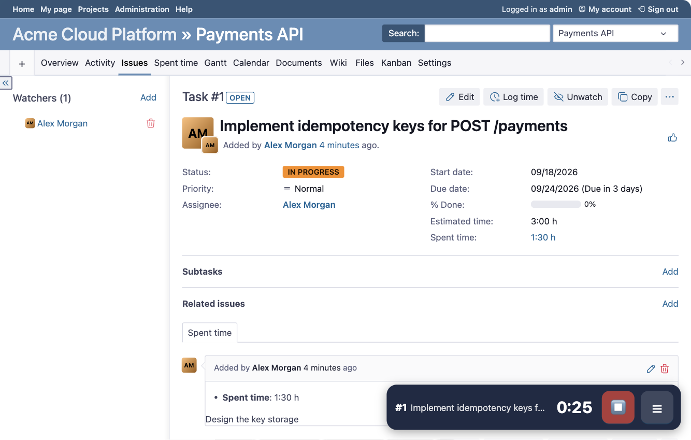
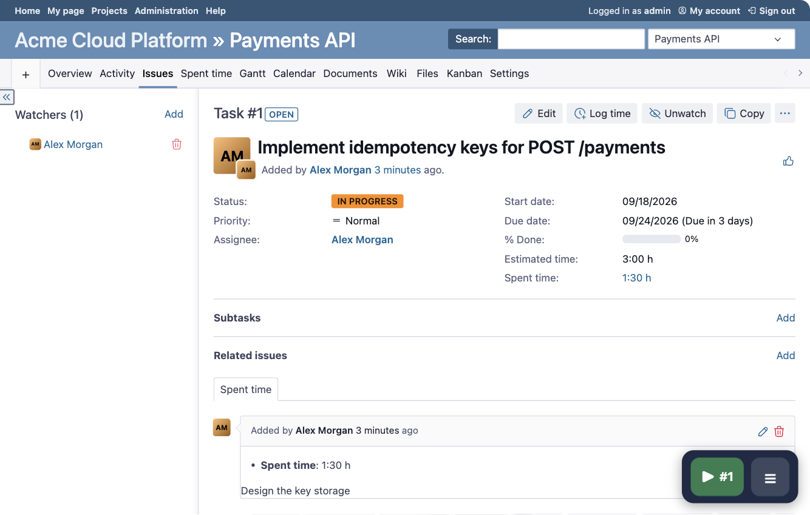
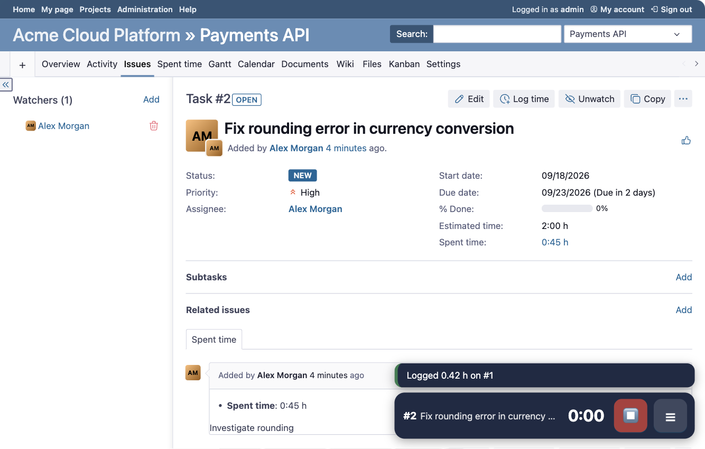
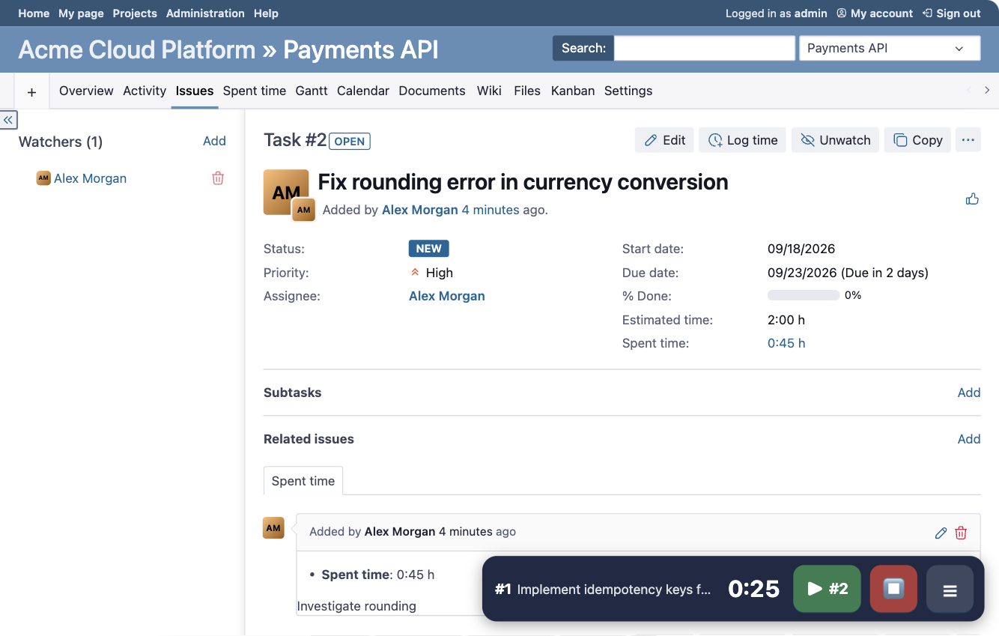
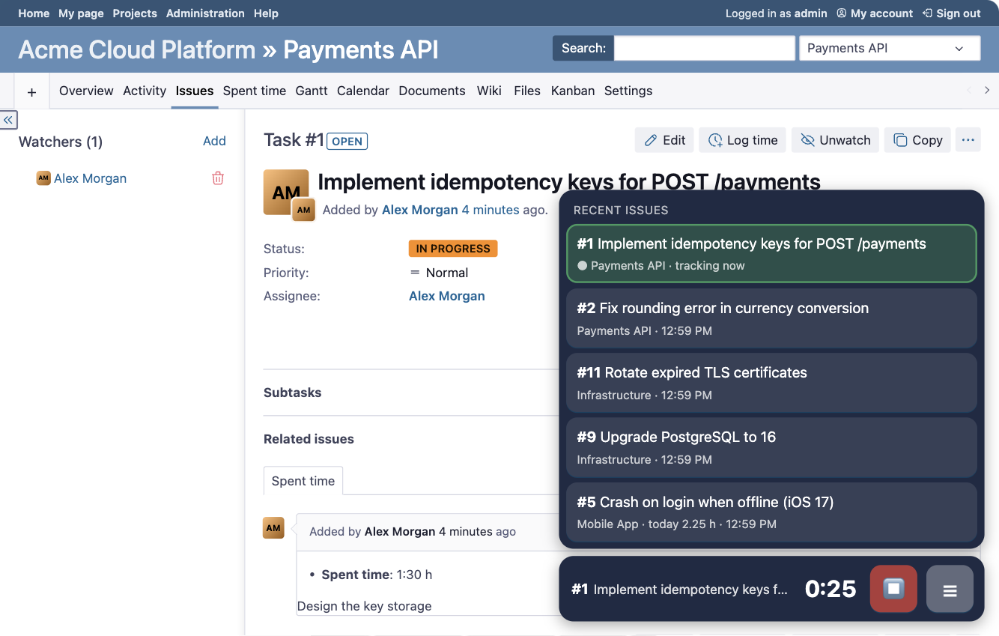
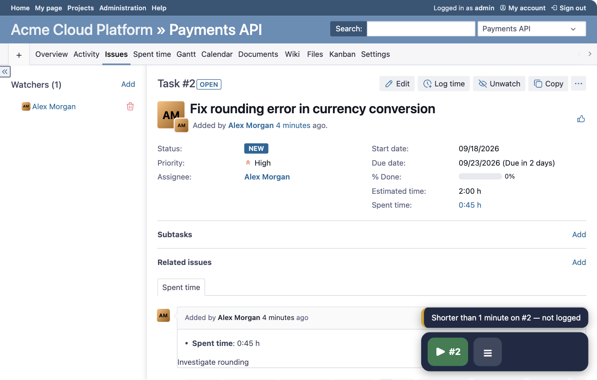
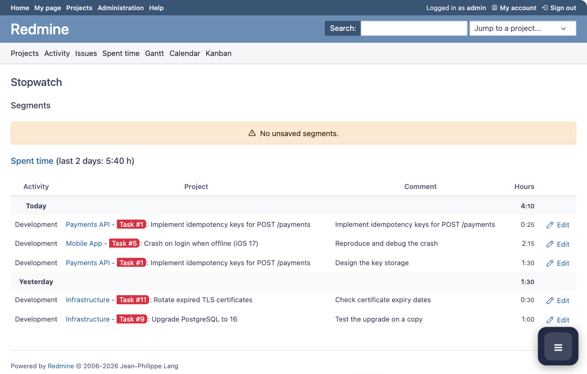
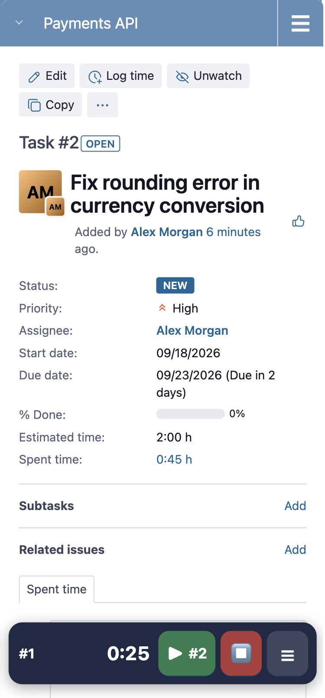
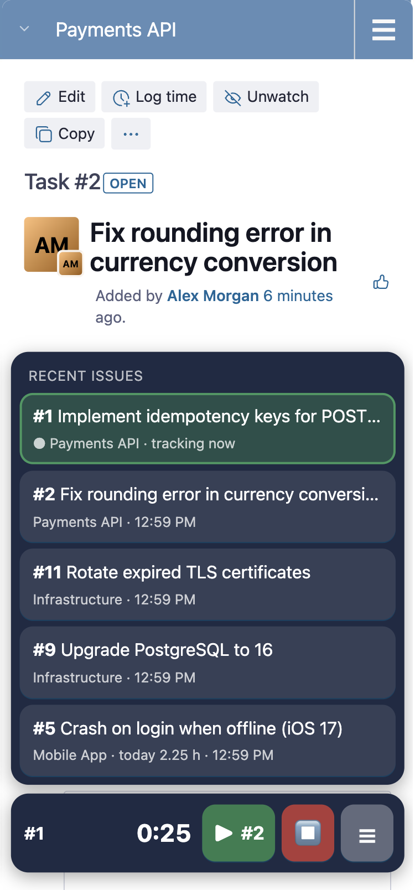
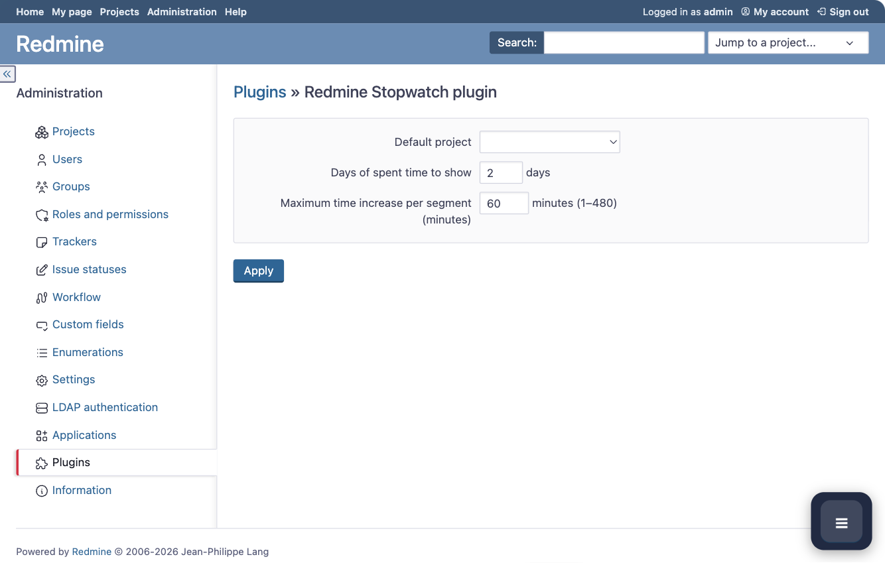

# Redmine Stopwatch plugin

A floating stopwatch for Redmine. Open an issue, press **▶**, work, press **⏹** — the elapsed time is written to
Redmine's **Spent time** automatically. Switching to another issue logs the previous one and starts a new timer, so the
time of a busy day is tracked without typing a single hour by hand.



---

## Features

- **One-click tracking** — the ▶ button on an issue page starts the timer on that issue; ⏹ stops it.
- **Automatic time entries** — a stopped (or switched) timer is logged to Redmine immediately: no confirmation,
  no form. The comment is the issue subject, the activity is the project's default one.
- **Fast switching** — the **☰ Recent issues** dialog lists the issues you tracked last; picking one logs the current
  segment and starts a new one on the chosen issue.
- **Nothing is ever lost** — if a segment cannot be logged, it is kept in the *Unsaved segments* list.
- **No accidental entries** — segments shorter than one minute are discarded and you are told about it.
- **Always visible** — a compact bar floats over the page (bottom-right); it never blocks the content and adapts to phones.
- **State on the server** — the timer keeps running when the tab or the browser is closed; all open tabs stay in sync.
- **Theme friendly** — the bar and its dialog do not conflict with the [Opale](https://github.com/gagnieray/opale) theme (checked on desktop and phone widths).
- **Localized** — English and Russian out of the box; other languages need one YAML file.

---

## Quick start

1. Open any issue you can log time on. The bar shows **▶ #ID**.

   

2. Press **▶**. The bar now shows the issue, the elapsed time (`H:MM`, updated every minute), **⏹** and **☰**.
3. Work. Navigate anywhere — the timer keeps running.
4. Press **⏹** to stop. The time is logged to the issue and a short notice tells you what was recorded.

   

### Switching between issues

While the timer runs, open another issue: the bar offers **▶ #other** next to the running timer.



Pressing it logs the time spent on the first issue and starts a fresh timer on the new one.
You can also switch without leaving the current page from the **☰** dialog.

### Recent issues (☰)

The dialog shows up to five open issues you logged time on most recently (the running one is always first, highlighted),
with the project, the time already logged **today** and the time of the last entry. Click an issue to switch to it.



Only issues you can see **and** log time on are listed.

### Very short segments

A segment shorter than **1 minute** is not written to Redmine. This protects against accidental clicks and
instant switches.



---

## What is written to Spent time

When a segment ends (stop or switch) the plugin creates a regular Redmine time entry:

| Field | Value |
|-------|-------|
| Project / issue | The issue the timer was running on |
| Hours | Elapsed time |
| Date | The day the segment **started**, in the user's time zone |
| Activity | The project's default activity (the first available one if there is no default) |
| Comment | The issue subject |

You can edit or delete the entry afterwards like any other (**Spent time**, or the *Edit* link on the Stopwatch page).

> **Set the time zone** in *My account* — the date of a time entry is calculated in the user's time zone;
> without it the date is taken in UTC.

If a segment cannot be turned into a time entry (no project, no activity available for the project, a validation error),
it is **kept** and the notice contains a link *Unsaved segments (N)*. A badge with the number of kept segments
is shown on the **☰** button, and the dialog gets the same link at the bottom.

---

## The Stopwatch page

`/stopwatch/segments` (reachable from the *Unsaved segments* links) collects everything related to your timer:



- **Active timer** — the running timer with editable time (`H:MM`), activity and comment. *Save* stores the comment and the
  activity; if you also change the hours, the entered time is saved as an unsaved segment below and the timer goes on
  (entering less than elapsed leaves the remainder running). *Stop* stops the timer and logs it with the entered
  comment and activity.
- **Segments** — unsaved segments grouped by date, with project, issue (autocomplete), hours, activity and comment.
  Each one can be **saved** (edited, kept), **logged** (a time entry is created and the segment removed) or **deleted**.
  Decreasing the hours splits the segment into the logged part and the remainder.
- **Other users' timers** — running timers of your colleagues, read-only (needs the *View other users' stopwatch* permission).
- **Spent time** — your latest time entries for the last N days, with links and *Edit* buttons.

---

## Mobile

On screens up to 600 px the bar becomes a compact pill while idle and a full-width bar while tracking.
The recent issues dialog opens right above it.

<p>
  
  &nbsp;&nbsp;
  
</p>

---

## Plugin settings

**Administration → Plugins → Redmine Stopwatch plugin → Configure**



| Setting | Meaning | Default |
|---------|---------|---------|
| Default project | Project pre-selected for segments without a project | empty |
| Days of spent time to show | How many days the *Spent time* block of the Stopwatch page covers | 2 |
| Maximum time increase per segment (minutes) | Upper limit when a segment's hours are edited upwards (1–480) | 60 |

---

## Permissions

**Administration → Roles and permissions**

| Permission | Purpose |
|------------|---------|
| **Use stopwatch** | Shows the bar and allows using the timer. Without it the user sees nothing and gets `403` on plugin URLs. |
| **View other users' stopwatch** | Optional. Shows other users' running timers on the Stopwatch page. |

To start a timer on an issue the user also needs the standard **Log spent time** permission in the issue's project
(and, of course, must be able to see the issue).

---

## Requirements

| Component | Version |
|-----------|---------|
| Redmine | 6.1 or newer |
| Ruby | 3.2 or newer |
| Rails | 7.2 |
| Database | PostgreSQL (used in production) or MySQL/MariaDB. Migration `005` converts the character set on MySQL/MariaDB only and is skipped on other databases |

The plugin has no extra gem dependencies.

---

## Installation

1. Put the plugin into Redmine's `plugins` directory. The directory **must be named exactly `redmine_stopwatch`**:

   ```bash
   cd /path/to/redmine/plugins
   git clone --branch v2.1.0 https://github.com/pendyurinandrey/redmine_stopwatch.git redmine_stopwatch
   ```

   In a Docker image, do the same in the `Dockerfile` (and run the migrations on start):

   ```dockerfile
   RUN git clone --depth 1 --branch v2.1.0 \
           https://github.com/pendyurinandrey/redmine_stopwatch.git plugins/redmine_stopwatch \
       && rm -rf plugins/redmine_stopwatch/.git
   ```

2. Run the plugin migrations:

   ```bash
   cd /path/to/redmine
   bundle exec rake redmine:plugins:migrate RAILS_ENV=production
   ```

   The migrations create two tables: `stopwatch_timers` (one row per user with the timer state) and
   `stopwatch_segments` (segments that could not be logged automatically).

3. Restart Redmine (Puma, Passenger, ...). Plugin JS and CSS are copied to the public assets on start: after changing
   them restart again and hard-refresh the browser (<kbd>Ctrl/Cmd</kbd>+<kbd>Shift</kbd>+<kbd>R</kbd>).

4. Check **Administration → Plugins**: *Redmine Stopwatch plugin* must be listed.

5. Give the **Use stopwatch** permission to the roles that need it (see [Permissions](#permissions)).

### Updating

Replace the plugin directory with the new version, run `rake redmine:plugins:migrate` and restart Redmine.

### Uninstalling

```bash
cd /path/to/redmine
bundle exec rake redmine:plugins:migrate NAME=redmine_stopwatch VERSION=0 RAILS_ENV=production
rm -rf plugins/redmine_stopwatch
```

---

## Localization

English (`config/locales/en.yml`) and Russian (`config/locales/ru.yml`) are included; both files define the same keys.
To add a language, copy `en.yml`, translate the values and rename the top-level key to the locale code. The texts used by
the JavaScript bar are translated on the server, so no JS changes are needed.

---

## HTTP API

All endpoints require an authenticated user with the **Use stopwatch** permission. The browser widget authenticates with the
session cookie; scripts and the mobile app can use a **Redmine REST API key** for the four JSON timer endpoints (see below).
JSON responses have the same shape:

```json
{
  "state": "running",
  "elapsed_seconds": 1500,
  "elapsed_display": "0:25",
  "started_at": "2026-09-21T09:35:00Z",
  "accumulated_seconds": 0,
  "pending_segments_count": 0,
  "issue": { "id": 1, "subject": "…", "url": "/issues/1" },
  "result": null
}
```

`result` describes what a stop/switch did: `{"status":"logged","issue_id":1,"hours":0.42,"entry_id":7}`,
`{"status":"discarded","issue_id":1,"seconds":12}` or `{"status":"kept","issue_id":1,"reason":"no_activity"}`.

### Authentication with an API key

Enable **Administration → Settings → API → Enable REST web service** (the key is then shown in **My account → API access key**).
Send it in the `X-Redmine-API-Key` header and call the endpoints **with the `.json` suffix**:

```bash
curl -H 'X-Redmine-API-Key: <key>' https://redmine.example.com/stopwatch/state.json
curl -H 'X-Redmine-API-Key: <key>' -d issue_id=42 https://redmine.example.com/stopwatch/start.json
curl -X POST -H 'X-Redmine-API-Key: <key>' https://redmine.example.com/stopwatch/stop.json
curl -H 'X-Redmine-API-Key: <key>' https://redmine.example.com/stopwatch/recent.json
```

* Open to API keys: `state`, `start`, `stop`, `recent`. Everything else (`pause`, `resume`, `snap`, the Stopwatch page ...) is
  session-only and answers `403` to an API key.
* A `.json` URL is a Redmine *API request*: the browser session is ignored and no CSRF token is needed; the widget calls the same
  actions without the suffix and keeps using session and CSRF (`POST /stopwatch/start` with a key but without `.json` is rejected).
* The timer is the user's single server-side timer: one started through the API is the same timer the browser widget shows,
  and a stop through the API writes the same time entry (comment = issue subject).
* Answers: `401` — no or invalid key; `403` — the user lacks **Use stopwatch** (or the action is not open to API keys);
  `422` — `issue_id` is missing, or the issue is not visible / time cannot be logged on it.
* Redmine's other API authentication methods (HTTP Basic, OAuth) work for these endpoints as for any Redmine API resource.
* **The key gives the same access as the account**: keep it secret, use HTTPS only, reset it in *My account* if it leaks.

### Timer (JSON)

| Method | URL | Description |
|--------|-----|-------------|
| GET | `/stopwatch/state.json` | Current timer state |
| POST | `/stopwatch/start.json` | Start on `issue_id` (required). If the timer runs on another issue, the running segment is logged and a new one starts |
| POST | `/stopwatch/stop.json` | Stop and log the running segment |
| GET | `/stopwatch/recent.json` | Recent issues for the ☰ dialog (up to 5, the running issue first) |
| GET | `/stopwatch/issue_project/:issue_id.json` | Project of an issue (used by the autocomplete on the Stopwatch page) |
| POST | `/stopwatch/pause.json`, `/stopwatch/resume.json` | Pause / resume. Kept for compatibility, the bar does not use them |
| POST | `/stopwatch/snap.json` | Alias of `start` (kept for compatibility) |

The endpoints belong to the browser session: they use the session cookie and, for `POST`, the CSRF token
(`X-CSRF-Token`); Redmine REST API keys are not supported. The user must be able to see the issue and log time on it, otherwise the answer is `422` with an `error` message.

### Stopwatch page (HTML)

| Method | URL | Description |
|--------|-----|-------------|
| GET | `/stopwatch/segments` | The Stopwatch page |
| POST | `/stopwatch/segments/:id/update` | Save the fields of an unsaved segment |
| POST | `/stopwatch/segments/:id/save` | Log the segment as a time entry |
| DELETE | `/stopwatch/segments/:id` | Delete the segment |
| POST | `/stopwatch/timer/update_comment` | Save comment, activity and (optionally) time of the running timer; `stop=1` also stops it |

---

## How it works

1. On every page the server renders a hidden `#stopwatch-widget` element with the timer state, the issue shown on the
   page, the running issue and the translated texts in `data-*` attributes. It is added only for users with the
   *Use stopwatch* permission.
2. `stopwatch.js` builds the bar from these data. The elapsed time is calculated in the browser from the start time,
   the display is refreshed once a minute.
3. The buttons call the JSON API. A stopped or switched timer creates a *segment* and turns it into a Redmine time entry
   in the same request (`StopwatchTimer#auto_log_segment`); only a failure leaves the segment in `stopwatch_segments`.
4. The timer state lives in the database, so it survives closing the browser.
5. Other tabs are updated through `BroadcastChannel`; in addition every tab re-reads the state from the server when it
   gets focus, becomes visible again, is restored from the back/forward cache and once a minute while visible.

---

## Plugin structure

```
redmine_stopwatch/
├── init.rb                               # Plugin registration, settings, permissions
├── config/
│   ├── routes.rb                         # JSON API and Stopwatch page routes
│   └── locales/{en,ru}.yml               # Localization
├── app/
│   ├── controllers/stopwatch_controller.rb
│   ├── models/
│   │   ├── stopwatch_timer.rb            # Timer state, start/stop/switch, automatic logging
│   │   └── stopwatch_segment.rb          # Segments that could not be logged automatically
│   └── views/
│       ├── settings/_stopwatch_settings.html.erb
│       └── stopwatch/
│           ├── _widget.html.erb          # Data container for the bar
│           └── segments.html.erb         # Stopwatch page
├── assets/
│   ├── javascripts/stopwatch.js          # The bar, the recent issues dialog, synchronization
│   └── stylesheets/stopwatch.css
├── db/migrate/                           # 001 – 007
├── lib/stopwatch_hook_listener.rb        # Injects CSS/JS and the data container into every page
└── Doc/en_EN/Manual/images/              # Screenshots used by this README
```

---

## Credits and license

This plugin is a fork of [ipslv/redmine_stopwatch](https://github.com/ipslv/redmine_stopwatch) (SIA IPS) with a redesigned
interface: a floating bar, automatic time entries, a recent issues dialog and fixes for multi-tab use. The original
repository does not contain a license file, so ask the authors before redistributing the code.
